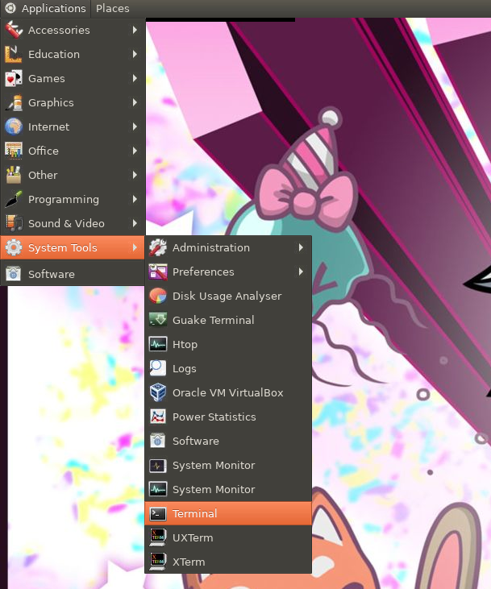
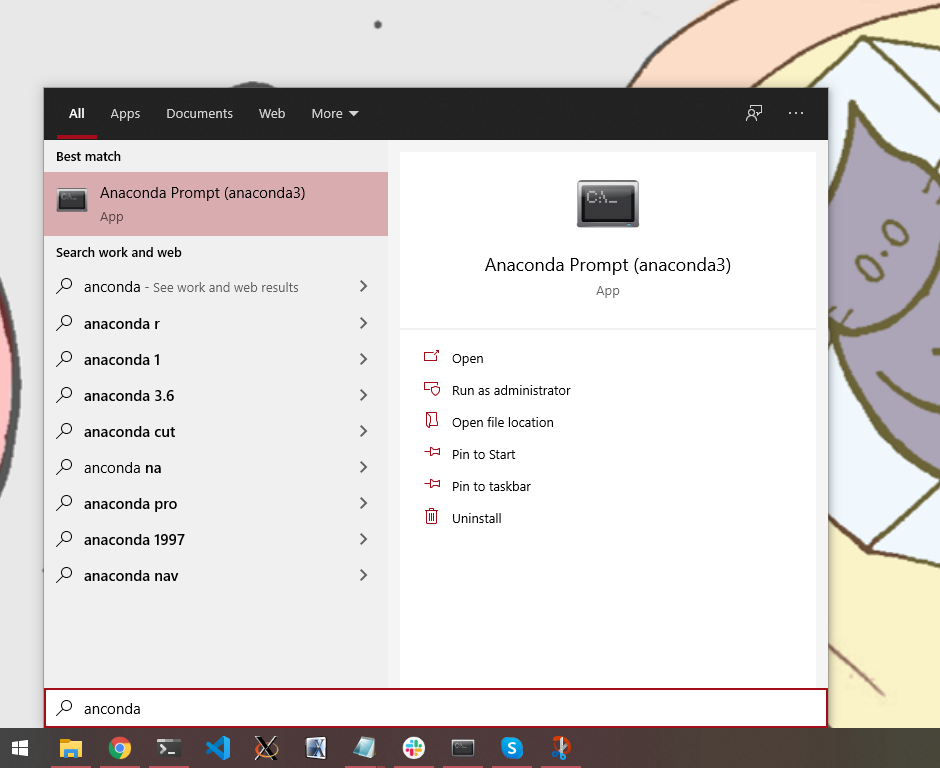
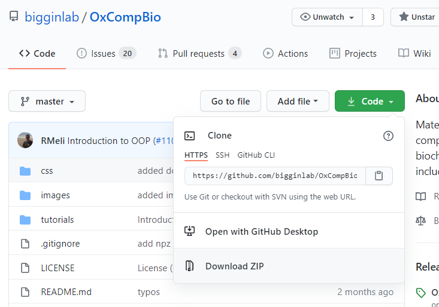
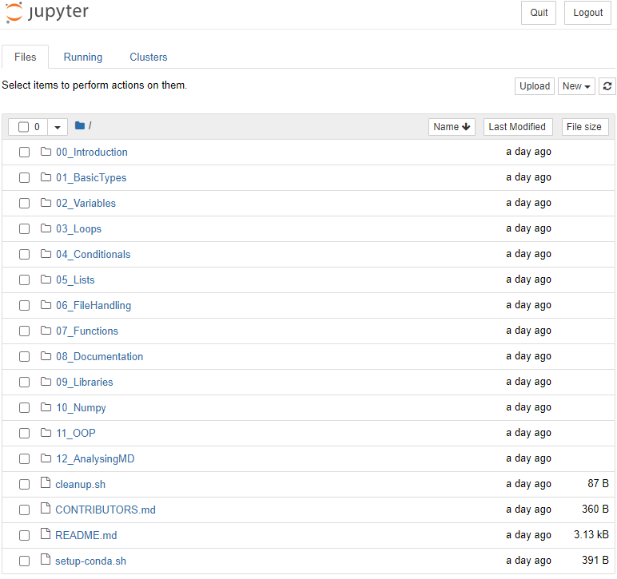
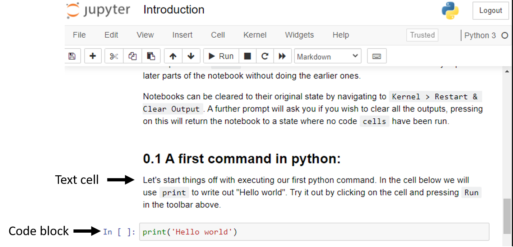
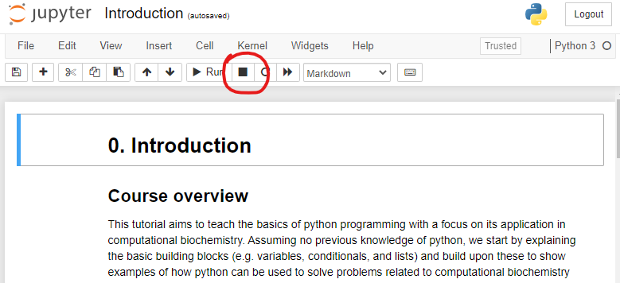
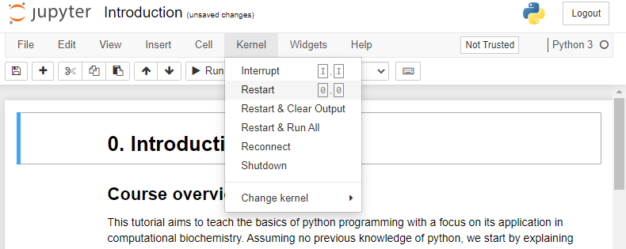

# Main setup instructions for the Oxford Computational Biochemistry course

The Oxford Computational Biochemistry course contains 4 self-contained
tutorials which each have different software installation requirements. These
instructions can be found in the respective tutorial's folder. Here we
provide some basic instructions on the base setup requirements common to these
tutorials and how to obtain a local copy of the materials.

In order to ensure that you have everything ready in advance of the workshop,
we ask that you **follow these setup instructions before attending each tutorial**.
Q&A sessions will be setup on the two days preceeding the course to help you
with any issues you might encounter during the setup process.


## 1. [Anaconda]

All tutorials in this course rely heavily on the [Anaconda] package manager.
This cross platform tool allows you to install other software packages in an
easy and controllable manner. We require all attendees to install this prior
to starting any of the tutorials. Please see the follow the [Anaconda install instructions]
to get started.

The [Anaconda] package manager, is named [conda]. Throughout the tutorials you
will see several invocations of [conda], including to create [environments] and
install software. If you are unfamiliar with this tool, it is heavily
recommened that you go through the [getting started guide].


## 2. Using the terminal

Throughout the tutorials we will be interacting with various software through
the use of a terminal interface. Terminals are a powerful means by which to
navigate through files and quickly execute various programs.

On linux/macOS this is generally done though a bash/zsh shell.

- In linux this can be accessed by searching for terminal in the startup menu.
  See below for an example in the ubuntu gnome shell.



- On macOS this is done by searching for terminal in the Launchpad (see the
  [following for more details][apple terminal support]).

(Todo: Insert picture of opening terminal in macOS here)

On Windows (unless using WSL in which case please follow the linux instructions),
this will be done via the Anaconda prompt. The Anaconda prompt can be opened by
searching for it in the startup menu after having installed Anaconda (see the
step above).



There are substantial differences in the way in which the terminal works between
Windows and linx/macOS. We will give a quick overview of the the basics below,
including some links for extra resources you can look at to get more familiar
with using the shell. We recommend that you have a look through these before
attempting the tutorials.

Note: in the MD tutorial you will eventually be required to access a remote
HPC machine to run a Molecular Dynamics simulations. This will require use
of the linux terminal. If you are using Windows you will therefore also need
to look at the instructions for the linux terminal before attempting this tutorial.

### Basic linux/macOS terminal instructions

This section only provides a very basic overview of using the bash/zsh shell
in linux/macOS. For more information please see the following tutorials:

- [Ubuntu's terminal tutorial](https://ubuntu.com/tutorials/command-line-for-beginners#1-overview)

**_On first opening the terminal_**

Generally upon opening the terminal you will be placed in your $HOME directory.
This is the base directory where all the documents for your login account are
placed. If you ever need to return to this directory enter the following command:

```
cd $HOME
```
or even just

```
cd
```


**_Seeing and navigating the contents of folders_**

One of the main uses of the terminal is to allow users to quickly see and navigate
through the various files and folders on your computer.

You can see what files are in the current folder you are accessing using:

```
ls -lrt
```

You can change from one folder to another (in this case named 'newfolder') by doing:

```
cd newfolder
```

If you want to know where you are amongst all your folders you can do:

```
pwd
```

This will give you the full path to the current folder.

If you want to delete (remove) a file do:

```
rm file
```

If you want to rename a file do:

```
mv file newfilename
```

If you want to print the contents of a file do:

```
more file
```


### Basic Windows Anaconda terminal instructions

This section only provides a very basic overview of using the Anaconda terminal.
For more information please see the following tutorials:

- Tutorials

**_On first opening the terminal_**

Generally upon opening the terminal you will be placed in your %HOMEPATH% directory.
This is the base directory where all the main folders (My Documents, Downloads, etc...)
for your login account are placed, which is usually `C:\Users\username`. If you ever
need to return to this folder enter the following command:

```
cd %HOMEPATH%
```

**_Seeing and navigating the contents of folders_**

One of the main uses of the terminal is to allow users to quickly see and navigate
through the various files and folders on your computer.

You can see what files are in the current folder you are accessing using:

```
dir
```

You can change from one folder to another (in this case named 'newfolder') by doing:

```
cd newfolder
```

If you want to know where you are amongst all your folders you can do:

```
cd
```

This will give you the full path to the current folder.

If you want to delete (remove) a file do:

```
del file
```

If you want to rename a file do:

```
rename file newfilename
```

If you want to print the contents of a file do:

```
more file
```

### Using editors

At several points during the tutorials you might be asked to edit a file.

There are several editors available and generally we recommend you use
the one that you are most accustomed with (if possible).

Here are our recommendations for editors that can be invoked directly from
the command line:

#### linux/macOS

- [gedit](https://help.gnome.org/users/gedit/stable/) (recommended for linux, usually pre-installed)
- [nano](https://wiki.gentoo.org/wiki/Nano/Basics_Guide) (recommended for linux & macOS, pre-installed)
- [TextEdit](https://support.apple.com/en-gb/guide/textedit/welcome/mac) (for macOS, pre-installed.  From the terminal prompt you can issue `open -a TextEdit`)
- [vim](https://www.vim.org/download.php)

#### Windows

- notepad (recommended)

Built into Windows, just type `notepad filename` in your terminal. This will open a
window where you can edit the file, save and then close the window to get back to
your terminal.

- [notepad++](https://notepad-plus-plus.org/)
- [vim](https://www.vim.org/download.php)


## 3. Downloading a local copy of the course materials

In order to carry out the exercies presented in the tutorials you will need to
download a local copy of the course materials. There are two ways of doing this;

### Recommended: download a copy from github

Simply go to the tutorial github page: https://github.com/bigginlab/OxCompBio

On the top left-hand side of the page you will see a green button titled "Code".

Click on it and then click on "Download ZIP".



This will download a copy of the course materials to your computer. Then simply
move the zip file to some convenient folder (ideally easily accessible through your
terminal), and extract it (macOS: double click, windows: right-click and extract all).

This will create a folder named `OxCompBio`.

### Not recommended: Git clone 
This is not a recommended option, but can be useful if you are using linux/macOS
and are already quite familiar with `git`.

Simply do:

```
git clone https://github.com/bigginlab/OxCompBio.git
```

In a convenient place for you to place the course materials. This will download
everything automatically to a local folder named `OxCompBio`.


## 4. [Jupyter notebooks]

The tutorials rely on the use of [Jupyter notebooks] to provide an interactive
experience, particularly when dealing with python code. The install
instructions for each tutorial will install a copy of the jupyter notebook
interface where required. We recommend that you start by setting up the
[python tutorial] and then look at some of the following resources on how to
use notebooks:

- [The jupyter notebook beginners guide](https://jupyter-notebook-beginner-guide.readthedocs.io/en/latest/execute.html)
- [Codeacademy's jupyter notebook tutorial](https://www.codecademy.com/articles/how-to-use-jupyter-notebooks)
- [Quick introduction to jupyter notebooks](https://www.youtube.com/watch?v=jZ952vChhuI) (youtube video)


Briefly, one usually starts a jupyter notebook session by opening a terminal,
navigating to the folder where `ipynb` (notebook) files are present, and
typing the following:

```
jupyter notebook
```

This should automatically open an interaction session in your browser.




You can then click on the `ipynb` (notebook) file to start it.

Jupyter notebooks are composed of cells, some of which contain normal text
(with a white background), and code blocks (shaded in grey).



Code blocks are meant to be interactive, you can type in them and press
`shift+Enter` to run the contents of the cells.

You can exit a notebook by clicking "File"->"Close and Halt"


Sometimes when too many things are running, notebooks can start to
behave erratically, when this happens clicking on the "interrupt" button
may help:



Alternatively, using one of the "Kernel"->"restart" options can be very useful.
Particularly, the "Restart & Clear Output" can be useful in cleaning up the notebook's
outputs and starting again:




## 5. What to do next

The next step is to do the individual setup steps for each tutorial.

These can be found at the following links:

- [Python](./tutorials/Python/setup.md)
- [Homology-Modelling](./tutorials/Homology-Modelling/setup.md)
- [MD](./tutorials/MD/setup.md)
- [Docking](./tutorials/Docking/setup.md)

[Anaconda]: https://www.anaconda.com/products/individual
[Anaconda install instructions]: https://www.anaconda.com/products/individual
[conda]: https://docs.conda.io/en/latest/
[environments]: https://docs.conda.io/projects/conda/en/latest/user-guide/getting-started.html#managing-envs
[getting started guide]: https://docs.conda.io/projects/conda/en/latest/user-guide/getting-started.html
[Jupyter notebooks]: https://jupyter.org/
[python tutorial]: ./tutorials/Python/setup.md
[apple terminal support]: https://support.apple.com/en-gb/guide/terminal/apd5265185d-f365-44cb-8b09-71a064a42125/mac#:~:text=Open%20Terminal&text=Click%20the%20Launchpad%20icon%20in,%2C%20then%20double%2Dclick%20Terminal.
